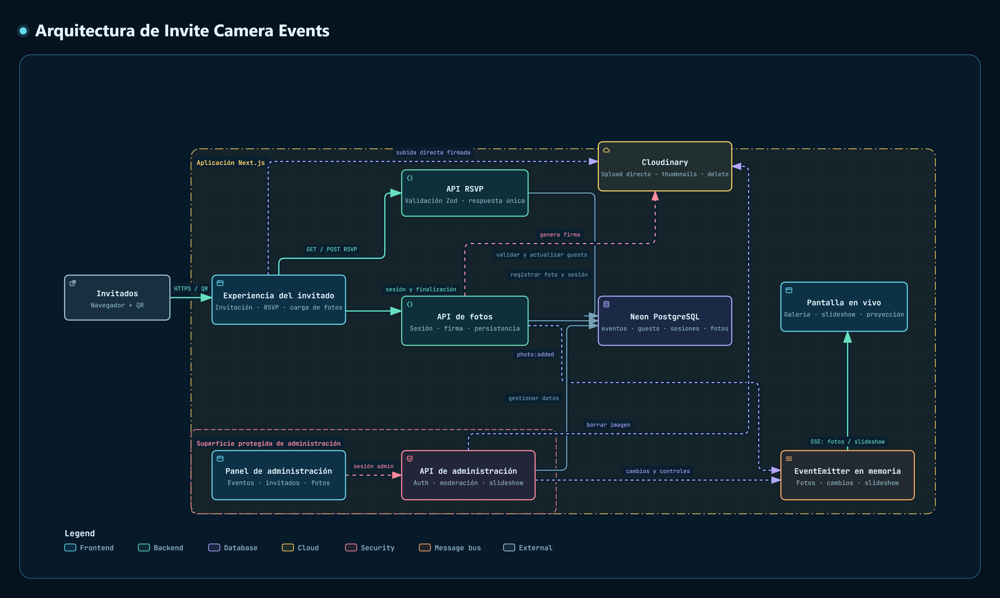

# Invite Camera Events

Plataforma web para bodas y eventos que conecta invitaciones, RSVP y recuerdos compartidos en tiempo real.

Los invitados escanean un QR desde su mesa, confirman su asistencia y suben fotos desde el celular —sin instalar ninguna app—. Las imágenes pueden moderarse y proyectarse en vivo durante el evento.

## Funcionalidades

- Invitaciones personalizadas con tokens únicos.
- Confirmación de asistencia (RSVP).
- Carga de fotos mediante QR por mesa.
- Límite configurable de fotos por mesa.
- Moderación de fotos y detección NSFW.
- Galería y slideshow en vivo.
- Control administrativo de pausa, avance y velocidad.
- Descarga individual o masiva de fotos aprobadas.
- Revelado posterior de la galería.

## Arquitectura



La aplicación usa Next.js como frontend y backend, Neon para persistencia, Cloudinary para almacenamiento de imágenes y Server-Sent Events (SSE) para transmitir nuevas fotos y controles del slideshow a las pantallas en vivo.

## Stack

- Next.js 16
- React 19
- TypeScript
- Neon PostgreSQL
- Cloudinary
- Server-Sent Events (SSE)
- Vercel

## Desarrollo local

```bash
npm install
npm run dev
```

Abrí [http://localhost:3000](http://localhost:3000).

## Configuración

Copiá `.env.example` como `.env.local` y completá:

```env
DATABASE_URL=
NEXT_PUBLIC_CLOUDINARY_CLOUD_NAME=
CLOUDINARY_API_KEY=
CLOUDINARY_API_SECRET=
ADMIN_PASSWORD=
WEDDING_CONTACT_NAME=
WEDDING_CONTACT_PHONE=
```

Para configurar la base de datos, generar QRs y desplegar el evento, consultá [`RUNBOOK.md`](./RUNBOOK.md).

## Scripts

```bash
npm run dev       # servidor de desarrollo
npm run build     # build de producción
npm run lint      # análisis estático
npm run db:reset  # reset y seed de la base de datos
npm run load:test # prueba de carga
```

## Despliegue

La aplicación está preparada para desplegarse en Vercel. La carga desde cámara requiere HTTPS. Para el procedimiento completo, variables de entorno y operación durante el evento, consultá [`RUNBOOK.md`](./RUNBOOK.md).
